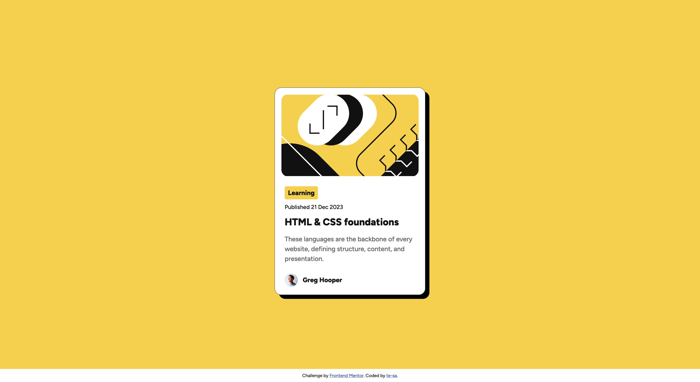

# Frontend Mentor - Blog preview card solution

This is a solution to
the [Blog preview card challenge on Frontend Mentor](https://www.frontendmentor.io/challenges/blog-preview-card-ckPaj01IcS).
Frontend Mentor challenges help you improve your coding skills by building realistic projects.

## Table of contents

- [Overview](#overview)
    - [The challenge](#the-challenge)
    - [Screenshot](#screenshot)
    - [Links](#links)
- [My process](#my-process)
    - [Built with](#built-with)
    - [Continued development](#continued-development)
    - [Useful resources](#useful-resources)

## Overview

### The challenge

Users should be able to:

- See hover and focus states for all interactive elements on the page

### Screenshot

### Links

- Solution URL: [Solution URL](https://github.com/te-sa/blog-preview-card/blob/main/index.html)
- Live Site URL: [Live site URL here](https://te-sa.github.io/blog-preview-card/)

## My process

### Built with

- Semantic HTML5 markup
- CSS

### Continued development

Might consider adding my CSS into a separate style sheet.

### Useful resources

- [StackOverflow](https://stackoverflow.com/questions/11700985/margin-top-not-working-for-span-element) - I wasn't sure why margin-top was not working for my span element. This post made me realize that inline elements like span don't have vertical margins. I was able to add the desired margin after adding `display: inline-block;` to the span.
- [CSS Reset](https://www.joshwcomeau.com/css/custom-css-reset/) - A solid example CSS reset with thorough explanations for every line.
